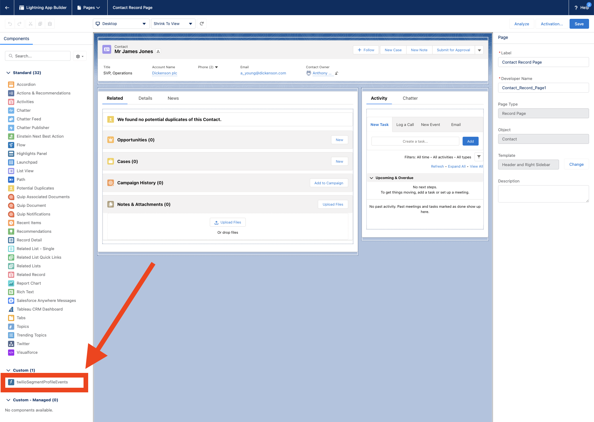
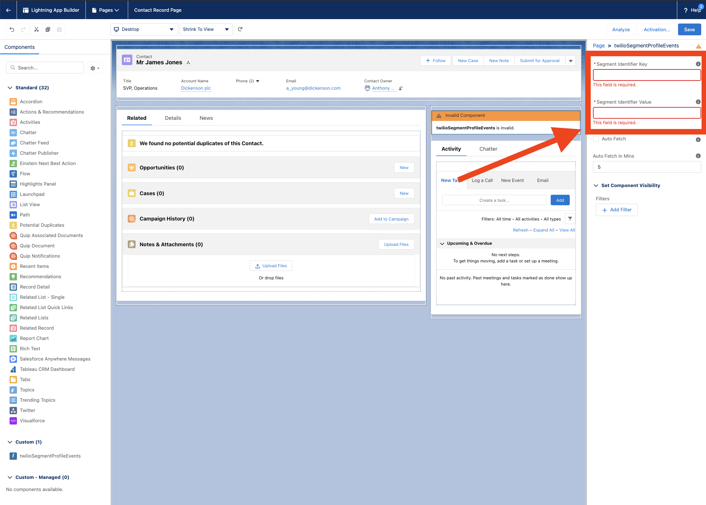
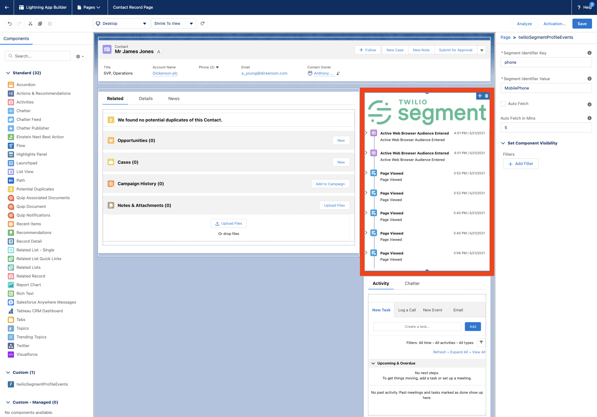

# Twilio Segment Salesforce Demo

## Prerequisite

You will need the following:
- [Twilio Segment Account](https://segment.com/)
- [Twilio Segment - Access Token](https://segment.com/docs/personas/profile-api/#configure-access)

## Getting Started

### Install
- Package Id: 04t5e000000yVpf
- [Production](https://login.salesforce.com/packaging/installPackage.apexp?p0=04t5e000000yVpf)
- [Sandbox](https://test.salesforce.com/packaging/installPackage.apexp?p0=04t5e000000yVpf)

### Twilio Segment Credentials

1. Go to Quick Find > Custom Metadata Types.
2. Click Twilio Segment Profile Credential.
3. Click Manage Twilio Segment Profile Credentials.
4. Click New.
5. Fill in the following values:

| Field                                  | Value                                   |
|----------------------------------------|-----------------------------------------|
| Label                                  | Default                                 |
| Twilio Segment Profile Credential Name | Default                                 |
| Space Id                               | INSERT YOUR TWILIO SEGMENT SPACE ID     |
| Access Token                           | INSERT YOUR TWILIO SEGMENT ACCESS TOKEN |

6. Click Save

### Adding LWC Component 

1. Go to a Record Page.
2. Click on the gear icon and Select `Edit Page`.
3. Under `Custom`, drap and drop the `twilioSegmentProfileEvents` on the page.

4. In the text field, add your Segment Id Key and Segment Id Value. The Segment Id Value should be the sObject Field.

5. If you did everything correctly, then you should see the information render.
