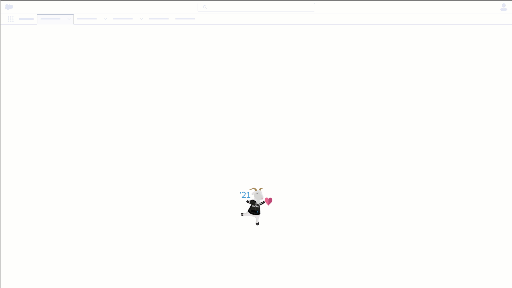

# Twilio Segment Salesforce Demo

## Prerequisite

You will need the following:
- [Twilio Segment Account](https://segment.com/)
- [Twilio Segment - Access Token](https://segment.com/docs/personas/profile-api/#configure-access)

## Getting Started

### Install
- Package Id: 04t5e000000ynba
- [Production](https://login.salesforce.com/packaging/installPackage.apexp?p0=04t5e000000ynba)
- [Sandbox](https://test.salesforce.com/packaging/installPackage.apexp?p0=04t5e000000ynba)

### Twilio Segment Credentials

1. Go to Quick Find > Custom Metadata Types.
2. Click Twilio Segment Profile Credential.
3. Click Manage Twilio Segment Profile Credentials.
4. Click New.
5. Fill in the following values:

| Field                                  | Value                                   |
|----------------------------------------|-----------------------------------------|
| Label                                  | Default                                 |
| Twilio Segment Profile Credential Name | Default                                 |
| Space Id                               | INSERT YOUR TWILIO SEGMENT SPACE ID     |
| Access Token                           | INSERT YOUR TWILIO SEGMENT ACCESS TOKEN |

6. Click Save

### Setting up

Watch this [video](https://youtu.be/QZyQ54WJQkA).